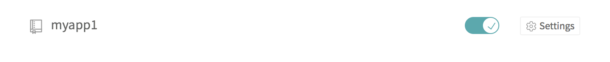
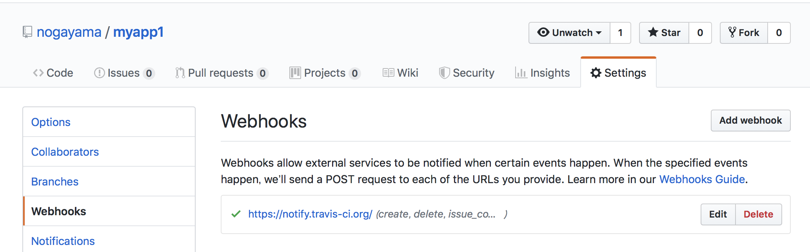

# myapp1


[Encrypting environment variables](https://docs.travis-ci.com/user/environment-variables#encrypting-environment-variables)

- [Travis CI Org](https://travis-ci.org)
- [Docker Hub](https://hub.docker.com)

nogayama	ShinkawasakiSquare

1. Write Dockerfile
2. Write .travis.yml

```
language: bash

services:
  - docker

before_install:
  - docker image build --tag nogayama/test1:latest .

script:
  - echo hello
```

1. Go [Travis CI Org](https://travis-ci.org) with Github authentication
2. Enable travis





1. push すると，テストが動く

1. `gem install travis`
2. `